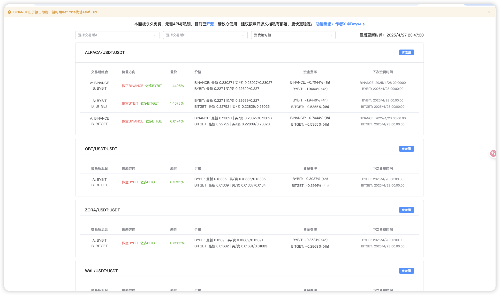

# fuding-panel


本面板集合BINANCE、BITGET、BYBIT、OKX的资费数据和盘口价差，方便资费套利和价差发现。
本工具不涉及私钥，不涉及下单，仅作为行情聚合。
第三方pacakge仅包含 axios,ccxt,express,cors。
数据更新可能延迟，请注意交易所其他公告。


## 04/27更新：
1. 将数据完全交给服务器缓存订阅，提升速度10倍以上
2. 支持两个交易所直接直接对比价差显示，价差及时性提高
3. 支持价差排序，方便价格套利交易发现路径
4. 币种筛选交给服务器规则，客户端更轻量(默认BITGET 交易量1M，资费绝对值0.1%)

## 初次发布
1. 使用本服务只需要一个费用极低甚至免费的海外服务器（1核1G就够了）
2. 解决其他产品上部分交易所无法同时完整显示：
   - 下次资费时间
   - 下次资费比例
   - 结算周期问题
3. 优化了流量占用，交给服务端后，大家可以共享使用
4. 解决其他面板前端订阅模式导致的交易所数据掉了不更新问题
5. 客户端不在需要挂梯子

界面上借鉴了taoli.live

## 安装

```bash
npm install
```

## 运行

```bash
npm start
```

服务器将在 [http://localhost:3000](http://localhost:3000) 启动。

## 跨域支持

API服务已配置跨域资源共享(CORS)，支持以下特性：

- 允许所有域名访问（可通过配置修改为指定域名）
- 支持 GET、POST、OPTIONS 请求方法
- 允许自定义请求头和响应头
- 支持发送cookies
- 预检请求缓存时间为24小时

## 支持的交易所

API服务支持以下交易所（不区分大小写）：

| 交易所 | 支持的ID |
|--------|----------|
| Binance | binance |
| OKX | okx, okex |
| Bitget | bitget |
| Bybit | bybit |

## API 接口

### 获取永续合约交易对数据

```
GET /api/swap-tickers?exchange=binance
```

参数：
- `exchange`: 交易所名称（不区分大小写）

返回示例：
```json
{
    "success": true,
    "data": {
        "BTC/USDT:USDT": {
            "symbol": "BTC/USDT:USDT",
            "last": 16597.00,
            "bid": 16596.00,
            "ask": 16597.50,
            "high": 30912.50,
            "low": 15700.00,
            "volume": 49337318,
            "timestamp": 1672376496682,
            "fundingRate": -0.001034,
            "fundingTime": 1672387200000,
            "fundingRateInterval": 8
        }
    }
}
```

### 获取资金费率数据

```
GET /api/funding-rates?exchange=binance
```

参数：
- `exchange`: 交易所名称（不区分大小写）

返回示例：
```json
{
    "success": true,
    "data": {
        "BTC/USDT:USDT": {
            "symbol": "BTC/USDT:USDT",
            "fundingRate": -0.001034,
            "fundingTime": 1672387200000,
            "fundingRateInterval": 8
        }
    }
}
```

### 获取K线数据

```
GET /api/kline?exchange=binance&symbol=BTC/USDT:USDT&timeframe=1m&limit=100
```

参数：
- `exchange`: 交易所名称（不区分大小写）
- `symbol`: 交易对
- `timeframe`: K线周期（1m, 5m, 15m, 1h, 4h, 1d）
- `limit`: 返回的K线数量

返回示例：
```json
{
    "success": true,
    "data": [
        {
            "timestamp": 1672376400000,
            "open": 16597.00,
            "high": 16598.00,
            "low": 16596.00,
            "close": 16597.50,
            "volume": 100.00
        }
    ]
}
```

### 获取订单簿数据

```
GET /api/orderbook?exchange=binance&symbol=BTC/USDT:USDT&limit=20
```

参数：
- `exchange`: 交易所名称（不区分大小写）
- `symbol`: 交易对
- `limit`: 返回的深度数量

返回示例：
```json
{
    "success": true,
    "data": {
        "bids": [
            [16596.00, 1.00],
            [16595.00, 2.00]
        ],
        "asks": [
            [16597.00, 1.00],
            [16598.00, 2.00]
        ]
    }
}
```

